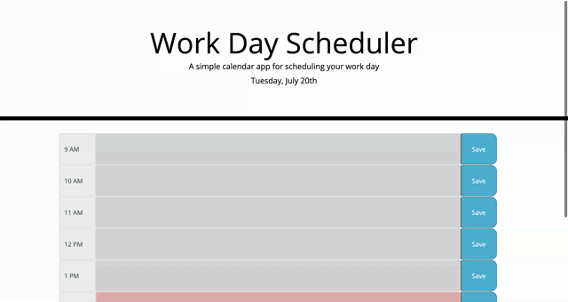

# Day Scheduler

## Description
Powered by jQuery, bootstrap, and moment js CDNs, Day Scheduler is a web application that allows a user to save data in color-coded time-blocks. The time range of the scheduler is 8am to 5pm. Time-blocks are color-coded for past, present and future time intervals. Gray corresponds to past, red to present and green to future. User will input data into the time-block of their choosing, then click the 'save' button to save their data and render it upon leaving the webpage or reloading it.

## Links

[Deployed Site](https://delaluz12.github.io/Day-Scheduler/)

[Site Respository](https://github.com/delaluz12/Day-Scheduler)

## Site Demo Video
Below is an animation of how the Day Scheduler functions. 

